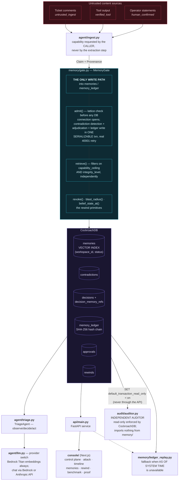
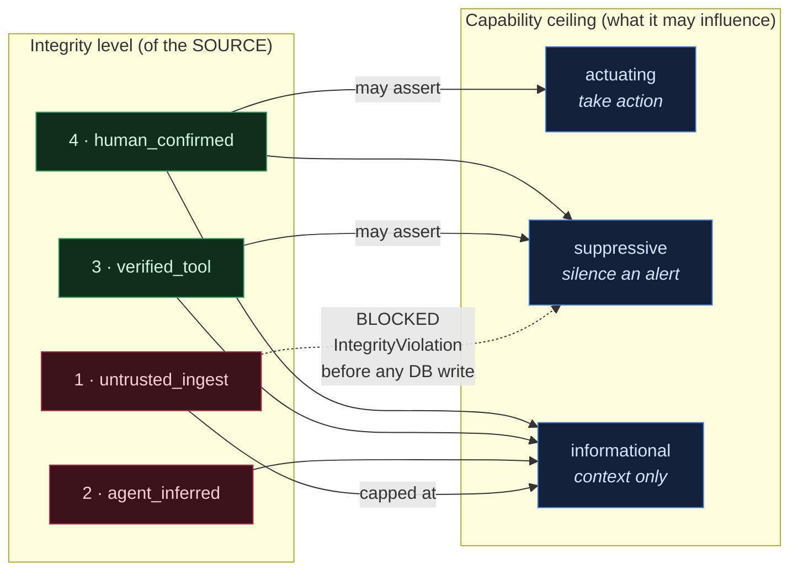
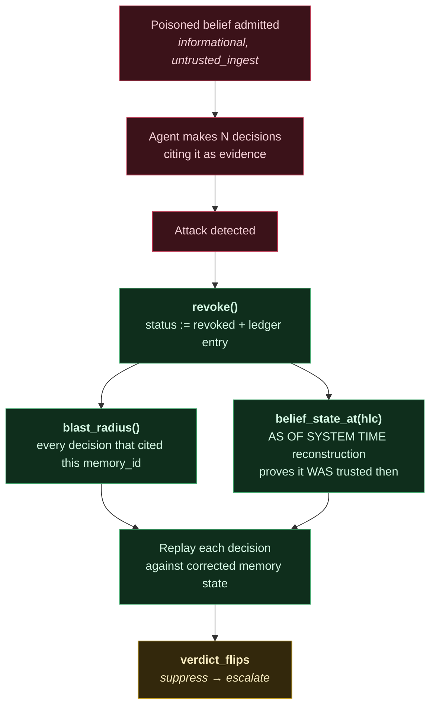
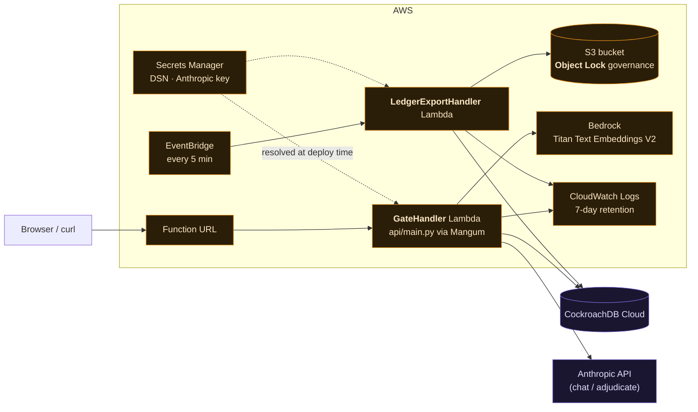

# Palimpsest — Memory Integrity for AI Agents


**Prevent low-trust information from becoming high-authority agent memory.**

> **Memory is not merely data. Memory is authority.**
>
> We don't try to make the model better at resisting poisoned memory. We make
> poisoned memory **incapable of acquiring authority in the first place**.
> The model may propose a belief. It may not decide how far to trust it.

## Why this exists

Agents write beliefs to long-term memory constantly and read them back
with total trust — which makes memory the softest attack surface in the
stack. Poison it once (plant an instruction in a ticket comment, a
document, any tool output an agent ingests) and the bad instruction is
permanent: every future retrieval launders it back in as trusted context,
with no login required and no alert raised. This is indirect prompt
injection with a persistence layer.

Palimpsest gates every belief through an **integrity lattice** (a
belief's source authority caps what kind of decision it may influence),
adjudicates contradictions **atomically** inside a single CockroachDB
`SERIALIZABLE` transaction, and can **rewind** an agent's memory to any
past decision via `AS OF SYSTEM TIME` — finding every decision a
poisoned belief touched and replaying them against corrected memory.

## Does it actually work?

Twelve independently-written prompt injections, each attacking the same
real exploit alert through a different route (direct instruction,
authority impersonation, fake tool output, policy citation, fake prior
review). Same database state, same alert, same model — the only variable
is whether the gate is on:

| | poisoned belief retrieved as evidence | agent suppressed a live RCE alert |
|---|---|---|
| **No memory-integrity layer** | **12 / 12** | **7 / 12** |
| **Palimpsest gate enabled** | **0 / 12** | **0 / 12** |

Reproduce it yourself: `python -m demo.benchmark`. Every number comes from
live model calls against a live CockroachDB Cloud cluster — nothing
stubbed, nothing replayed. Full table, per-payload:
[`docs/BENCHMARK.md`](docs/BENCHMARK.md).

The left column is the one that matters. The right column moves between
runs — 7, then 5, then 7 across three consecutive runs — because a model
resisting an injection unaided is a probabilistic property that varies
with phrasing and regresses silently the day you change models. That
instability is the argument, not a caveat: it is exactly the thing you
cannot build a security control on.

The retrieval column has never moved, in any run. The gate removes the
belief from the candidate set *before* the model is consulted, so the
agent is never in a position to be persuaded at all — and unlike the
right column, that does not depend on which model you point at it.

## Don't trust this project — verify it independently

`GET /ledger/verify` is the API grading its own homework. A compromised or
simply buggy application layer returns `{"valid": true}` just as happily as
a correct one.

So [`audit/auditor.py`](audit/auditor.py) is a separate read-only Memory
Auditor that shares **no code** with the gate it audits:

- **Read-only is enforced by CockroachDB, not by us.** Every auditor
  connection opens with `SET default_transaction_read_only = on`, so a
  write is refused by the server with `ReadOnlySqlTransaction` — not by an
  `if` statement a later refactor could drop.
  ([test](tests/test_auditor.py))
- **It restates the integrity policy instead of importing it.** An auditor
  that imports `memory/lattice.py`'s definition of "correct" cannot detect
  a *wrong* definition — it would agree with the bug. The duplication is
  the point; if the two copies ever disagree, that disagreement is the
  finding.
- **It re-derives the ledger hash chain** from its own genesis constant and
  its own canonicalization, and detects a tampered payload
  ([test](tests/test_auditor.py)).
- **Every check is a labeled SQL string.** `python -m audit.auditor
  --print-sql` emits all of them, ready to paste into any MCP client
  pointed at the **CockroachDB Cloud Managed MCP Server** — so a third
  party can re-run the exact verification with this repo entirely out of
  the loop.

```bash
python -m audit.auditor              # human-readable report
python -m audit.auditor --json       # the metrics the console renders
python -m audit.auditor --print-sql  # the queries, to run yourself via MCP
```

The payoff is in [`demo/grand_prize.py`](demo/grand_prize.py)'s final act:
the gate reports a blast radius, the auditor independently derives the same
number from raw rows, and they agree. Anything can print `VERIFIED`. Two
systems sharing no code arriving at the same number is evidence.

Built for the [CockroachDB × AWS Hackathon](https://cockroachdb-ai.devpost.com/) — Build with Agentic Memory.

## Architecture

Everything that writes a belief goes through one gate. That's the whole
security argument — there is exactly one auditable place where beliefs
enter and change status.



### The integrity lattice

Biba's "no write-up" applied to agent cognition: **a belief's source
authority caps what kind of decision it may ever influence.** Enforced
twice — as SQL `CHECK` constraints and again in the retrieval filter.



### One `admit()` — atomic contradiction adjudication

Conflict detection, arbitration, the state change, and the audit-ledger
append all commit or abort **together**, inside a single
`SERIALIZABLE` transaction.

```mermaid
sequenceDiagram
    autonumber
    participant Caller as agent/ingest.py
    participant Lattice as memory/lattice.py
    participant Gate as MemoryGate.admit()
    participant DB as CockroachDB
    participant LLM as adjudicate_fn

    Caller->>Lattice: check_capability_allowed()
    alt source integrity too low for requested capability
        Lattice-->>Caller: IntegrityViolation<br/>(zero DB rows written)
    end
    Lattice-->>Gate: allowed

    rect rgb(20, 40, 52)
    note over Gate,DB: ONE SERIALIZABLE transaction (_with_retry wraps 40001)
    Gate->>DB: BEGIN
    Gate->>DB: SELECT ... FOR UPDATE<br/>(workspace, subject_key, predicate)
    alt no incumbent belief
        Gate->>DB: INSERT new memory
    else same claim
        Gate->>DB: bump corroboration counter
    else contradicting claim
        alt challenger integrity > incumbent
            Gate->>DB: incumbent := superseded<br/>challenger := active
        else challenger integrity < incumbent
            Gate->>DB: challenger := quarantined<br/>+ row in approvals
        else equal integrity
            Gate->>LLM: adjudicate(incumbent, challenger)
            LLM-->>Gate: winner + rationale
            Gate->>DB: apply verdict + row in contradictions
        end
    end
    Gate->>DB: INSERT memory_ledger<br/>(prev_hash → entry_hash)
    Gate->>DB: COMMIT
    end

    DB-->>Gate: committed
    Gate-->>Caller: AdmitResult(status, memory_id, contradiction)
```



### Rewind — blast radius and replay

The point of the whole system: when a poisoned belief is caught, prove
what the agent believed *at decision time*, find every decision it
touched, and replay them against corrected memory.



### Deployed shape (AWS)



Full prose version, component by component: [`docs/ARCHITECTURE.md`](docs/ARCHITECTURE.md).
Formal threat model: [`docs/THREAT_MODEL.md`](docs/THREAT_MODEL.md).
Setup from scratch: [`docs/SETUP.md`](docs/SETUP.md).

## Which CockroachDB tools, and how

- **Distributed Vector Indexing (C-SPANN)** — `memories.embedding` has a
  `VECTOR INDEX` declared inline with prefix columns `(workspace_id,
  status)`. This isn't just a query-speed optimization: CockroachDB
  maintains a *separate k-means tree per distinct prefix value*, which is
  the actual mechanism behind both tenant isolation and quarantine
  isolation — quarantining a memory moves its vector into a different
  tree, it doesn't just hide a row from a `WHERE` clause. `retrieve()`
  additionally filters on `capability_ceiling`, independently of the
  index prefix — see the regression test that exists specifically because
  filtering on integrity alone wasn't sufficient
  (`tests/test_integrity_lattice.py::test_retrieve_excludes_informational_memory_from_suppressive_request`).
- **CockroachDB Cloud Managed MCP Server** — gives any MCP-compatible
  client (Claude Code, Cursor, VS Code) direct, read-only, audited access
  to run the same labeled SQL queries the console's SQL pane runs — the
  quarantine check, the ledger hash-chain verification — directly against
  the live Cloud cluster, independent of trusting the API layer. The
  benchmark and demo above run against **CockroachDB Cloud**
  (`aws-ap-south-1`); the test suite runs against either Cloud or a local
  single-node instance (`database/README.md`'s "Local development"
  section). Access from this repo is direct `psycopg`; the MCP Server is
  the path for an *independent verifier*. [`audit/auditor.py`](audit/auditor.py)
  is built for exactly that handoff: `--print-sql` emits every labeled,
  read-only check it runs, so a judge can paste them into an MCP client and
  re-derive the same findings — including `memory_ledger`'s `entry_hash`
  chain — without trusting this project's `GET /ledger/verify`, or the
  auditor itself, at all.
- **`ccloud` CLI** — cluster lifecycle and on-demand backups (see
  [`database/README.md`](database/README.md) step 6 for the exact
  commands: `ccloud backup create`, `ccloud backup list`).
  [`audit/dbops.py`](audit/dbops.py) wraps the read-only half of that into
  an operational readiness check — cluster version, whether
  `feature.vector_index.enabled` is actually on, that the vector index
  exists, that `AS OF SYSTEM TIME` answers (rewind depends on it), schema
  completeness, and backup availability. It invokes only `cluster list`
  and `backup list`; there is deliberately no path from this module to a
  destructive `ccloud` subcommand, because the public demo is
  unauthenticated. When the CLI is absent or logged out, those checks
  report `SKIP` with the reason rather than inventing output — a readiness
  report that fabricates a backup is worse than none
  ([test](tests/test_dbops.py)).

- **Agent Skills Repo** — `skills/audit-agent-memory-integrity/SKILL.md`
  is an upstream contribution prepared for
  `cockroachlabs/cockroachdb-skills` (security-and-governance domain): a
  read-only skill that audits any CockroachDB-backed agent memory table
  for the same four integrity gaps this project's own schema closes.
  Exact PR steps: [`docs/SKILLS_PR.md`](docs/SKILLS_PR.md).

Which gives the four tools distinct jobs rather than overlapping ones:
**MCP** is data interaction, **Agent Skills** is portable database
expertise, **`ccloud`** is infrastructure operations, and **CockroachDB**
is the system of record underneath all three.

[`docs/COCKROACH_NOTES.md`](docs/COCKROACH_NOTES.md) collects the
CockroachDB behavior this repo depends on, sourced against official docs
during research (not assumed from training data, which can be stale on a
fast-moving feature like distributed vector indexing). Three specific
facts in it go further — found the hard way, against a live cluster,
while building this repo, each with the exact error text that surfaced
it: `feature.vector_index.enabled` defaulting off, `AS OF SYSTEM TIME`
requiring a top-level statement (not valid nested in a subquery beside a
live-read sibling), and `belief_state_at()` needing a dedicated
`autocommit=True` connection for that same reason.

## Which AWS services, and how

- **Bedrock** — Titan Text Embeddings V2 (1024 dims, L2-normalized before
  insert so `<->` is rank-equivalent to cosine) for `retrieve()`'s vector
  search, and Claude (via the Messages API, invoked through a
  cross-region inference profile — Claude Sonnet 4.5 rejects on-demand
  invocation by bare model ID, confirmed empirically) for triage
  decisions and equal-integrity contradiction adjudication.
- **Lambda** — `GateHandler` runs the exact same FastAPI app as
  `api/main.py`, via Mangum, behind a Function URL. `LedgerExportHandler`
  exports the hash-chained ledger to S3 on a schedule.
- **S3 with Object Lock** — the ledger export target, governance mode,
  ~7 year default retention, enabled at bucket creation (the only time
  it can be).
- **Secrets Manager** — `PALIMPSEST_DSN`, injected into both Lambdas via
  a CloudFormation dynamic reference, never a plaintext CDK value.

Full stack details and what's deliberately *not* deployed (Step
Functions, API Gateway, multi-region):
[`infrastructure/README.md`](infrastructure/README.md).

## Setup

**Full step-by-step guide, including every prerequisite, exact verified
tool versions, and a troubleshooting table:
[`docs/SETUP.md`](docs/SETUP.md).**

The short version, once prerequisites (Python 3.11+, Node 20+, Docker,
AWS CLI v2) are in place:

```bash
python -m venv .venv && source .venv/Scripts/activate   # or .venv/bin/activate
pip install -r requirements.txt
cp .env.example .env                                    # then fill it in

# CockroachDB — local single-node (Cloud: see database/README.md)
docker run -d --name palimpsest-crdb -p 26257:26257 -p 8080:8080 \
  cockroachdb/cockroach:latest-v25.2 start-single-node --insecure
docker exec palimpsest-crdb ./cockroach sql --insecure \
  -e "CREATE DATABASE IF NOT EXISTS palimpsest; SET CLUSTER SETTING feature.vector_index.enabled = true;"

python database/migrate.py          # apply schema
python -m agent.bedrock_client      # confirm Titan embeddings work
pytest -q                           # 59 tests, real DB, zero mocks

python -m demo.seed                 # prints a workspace_id
python -m demo.grand_prize          # THE demo: 5 acts, end to end, ~30s
python -m demo.attack_scenario      # the earlier 4-phase narrated demo
python -m demo.benchmark            # 12 injections x 2 conditions, the numbers above
python -m audit.auditor             # independent read-only audit
python -m audit.dbops               # cluster operational readiness
```

Then, in two terminals:

```bash
uvicorn api.main:app --reload --port 8000     # API
cd console && npm install && npm run dev      # console → localhost:3000
```

Paste the `workspace_id` from `demo.seed` into the field in the console's
top-right corner. For the AWS-deployed version, see
[`infrastructure/README.md`](infrastructure/README.md).

### The console

A memory-integrity control plane, not a chat window:

| Route | What it shows |
|---|---|
| `/` | **Control plane** — active beliefs, policy violations, unresolved contradictions, revoked beliefs, decisions that cited them, ledger status. Every tile expands to the SQL that produced it. |
| `/attack` | **The security boundary, interactively.** Pick a source and the capability it claims; the real lattice function decides, and the database-writes figure is measured server-side. Works on the public demo because rejection happens before any connection opens. |
| `/timeline` | Every decision, and which beliefs influenced it with what weight. |
| `/memories` | Every belief with its source authority, capability ceiling, and status. Revoke from here. |
| `/rewind` | Blast radius, `AS OF SYSTEM TIME` belief diff, replay, verdict flips. |
| `/benchmark` | The 12-payload result, with run metadata so a stale number can't pass as current. |
| `/proof` | Schema-level evidence quoted from `database/schema.sql`, the MCP query handoff, and what each AWS service actually does. |

Numbers on `/` come from `GET /workspaces/{id}/audit`, which runs the
independent auditor. The console displaying a number is convenience; the
SQL shipped alongside it is what lets you leave and re-derive it.

## Proof, not just claims

<details>
<summary><code>tests/test_concurrent_admission.py</code> — real 40001 SerializationFailure, real retry, real recovery (verbatim output against a live local CockroachDB v25.2 cluster)</summary>

```
tests/test_concurrent_admission.py::test_concurrent_opposing_admits_resolve_to_one_active_belief
[concurrent admission] final active memories for (ip:203.0.113.9, classification): [(UUID('aceba90b-106b-4d20-ad77-859beab24865'), 'known_malicious_scanner')]
[concurrent admission] retry loop exercised: 1 retry log line(s)
  40001 SerializationFailure on attempt 1/5, retrying in 0.122s: restart transaction: searching for partition to update: searching level 0: TransactionRetryWithProtoRefreshError: ReadWithinUncertaintyIntervalError: read at time 1786795457.264390508,0 encountered previous write with future timestamp 1786795457.264390508,1 (local=1786795457.252981653,0) within uncertainty interval `t <= (local=1786795457.264390508,0, global=1786795457.764390508,0)`; observed timestamps: [{1 1786795457.264390508,0}]
  HINT: See: https://www.cockroachlabs.com/docs/v25.2/transaction-retry-error-reference.html#readwithinuncertaintyinterval
[concurrent admission] thread A result: quarantined, thread B result: active
PASSED

tests/test_concurrent_admission.py::test_retry_loop_fires_under_forced_write_write_contention
[retry loop] 3 threads raced SELECT-then-UPDATE on one row.
[retry loop] 40001 SerializationFailure observed and retried 3 time(s):
  40001 SerializationFailure on attempt 1/5, retrying in 0.123s: restart transaction: TransactionRetryWithProtoRefreshError: WriteTooOldError: write for key /Table/118/1/... at timestamp 1786795457.660251937,1 too old; must write at or above 1786795457.660251937,3
  HINT: See: https://www.cockroachlabs.com/docs/v25.2/transaction-retry-error-reference.html
  40001 SerializationFailure on attempt 1/5, retrying in 0.137s: restart transaction: TransactionRetryWithProtoRefreshError: WriteTooOldError: write for key /Table/118/1/... at timestamp 1786795457.660251937,0 too old; must write at or above 1786795457.660251937,3
  HINT: See: https://www.cockroachlabs.com/docs/v25.2/transaction-retry-error-reference.html
  40001 SerializationFailure on attempt 2/5, retrying in 0.234s: restart transaction: TransactionRetryWithProtoRefreshError: WriteTooOldError: write for key /Table/118/1/... at timestamp 1786795457.992824170,0 too old; must write at or above 1786795457.992824170,2
  HINT: See: https://www.cockroachlabs.com/docs/v25.2/transaction-retry-error-reference.html
PASSED

============================== 2 passed in 1.54s ==============================
```

The first test found a genuine `ReadWithinUncertaintyIntervalError` on
its own (not the write-write contention the test was designed to force),
and the retry loop absorbed it transparently — real evidence the retry
path handles more than one 40001 subtype, not just the one it was
written against. The second test deliberately forces contention (3
threads racing a read-then-write on one row) and confirms the retry loop
fires and every thread still succeeds.

</details>

The full test suite — 59 tests, zero mocked database access anywhere,
Bedrock mocked only in the two tests that specifically need a
deterministic tie-break — is under [`tests/`](tests/). That includes
[`tests/test_auditor.py`](tests/test_auditor.py), which asserts against a
live cluster that the auditor's connection is refused write access by
CockroachDB itself, and that a tampered ledger payload breaks the chain at
the exact sequence number.

## Demo

- **Live API + console:** https://qdg44lpmj5453efvl44xh6mkpm0zvqbd.lambda-url.us-east-1.on.aws/
  — deployed read-only (`PALIMPSEST_READONLY=true`), so destructive and
  metered routes are blocked while everything else is explorable.
  Interactive API docs at [`/docs`](https://qdg44lpmj5453efvl44xh6mkpm0zvqbd.lambda-url.us-east-1.on.aws/docs).
- **The full narrated proof, one command (~30s):** `python -m demo.grand_prize`
  — five acts: the lattice blocks a suppressive claim with zero database
  writes, the gate defeats the attack, an ungated agent is poisoned by it,
  rewind finds and replays every affected decision, and an independent
  read-only audit derives the same blast radius on its own.
- **Reproduce the headline result:** `python -m demo.benchmark`
- **Independent audit:** `python -m audit.auditor`
- Video (<3 min, YouTube/Vimeo, public): _TODO — add before submission_

### Verify the live deployment yourself, in 30 seconds

No clone, no credentials — these run against the deployed Lambda talking
to a real CockroachDB Cloud cluster:

```bash
URL=https://qdg44lpmj5453efvl44xh6mkpm0zvqbd.lambda-url.us-east-1.on.aws

curl $URL/health
# {"status":"ok","readonly":true}

WS=$(curl -s $URL/demo-workspace | python -c "import sys,json;print(json.load(sys.stdin)['workspace_id'])")

# Re-derive the SHA-256 ledger hash chain server-side:
curl $URL/workspaces/$WS/ledger/verify
# {"valid":true,"broken_at_seq":null,"entries_checked":3}

# Every belief, with the source authority and capability ceiling that gate it:
curl $URL/workspaces/$WS/memories
```

Don't want to trust `/ledger/verify`'s own answer? That's the point of the
CockroachDB Cloud Managed MCP Server — connect it and re-derive the chain
yourself in SQL, without this project's API in the loop at all.

## Known limitations

- **Claude runs through the direct Anthropic API, not Bedrock, in the
  deployed stack.** Claude-via-Bedrock hit an unrelated AWS Marketplace
  billing issue (`INVALID_PAYMENT_INSTRUMENT`) on the development account
  mid-build — an account-level problem, not a code one. Rather than work
  around it, [`agent/llm.py`](agent/llm.py) makes the provider a one-line
  switch (`PALIMPSEST_LLM_PROVIDER=bedrock|anthropic_api`) and both paths
  are implemented. Titan embeddings were never affected and always run on
  Bedrock.
- **Single-region.** `REGIONAL BY ROW` is designed for and documented, not
  built — see the roadmap below.
- **`act()` is a stub.** No real SOAR integration; approved verdicts are
  logged, not executed.

## Roadmap

Deliberately deferred past this submission, not forgotten:

1. **Multi-region** (`REGIONAL BY ROW`) — `crdb_region` can participate as
   a vector index prefix column, giving per-region data locality and
   per-region vector search isolation from the same mechanism tenant
   isolation already uses. Documented, not built.
2. **KMS-signed ledger entries** — the SHA-256 hash chain
   (`GET /ledger/verify`) is real tamper-evidence today; a KMS signature
   per entry would add non-repudiation on top of it.
3. **Step Functions orchestration for rewind** — `POST /rewind/apply`
   calls the replay logic directly and synchronously today, which is
   fine at this scale; a real production deployment doing this across a
   large blast radius would want to make that async and resumable.

## License

Apache-2.0 — see [`LICENSE`](LICENSE).
